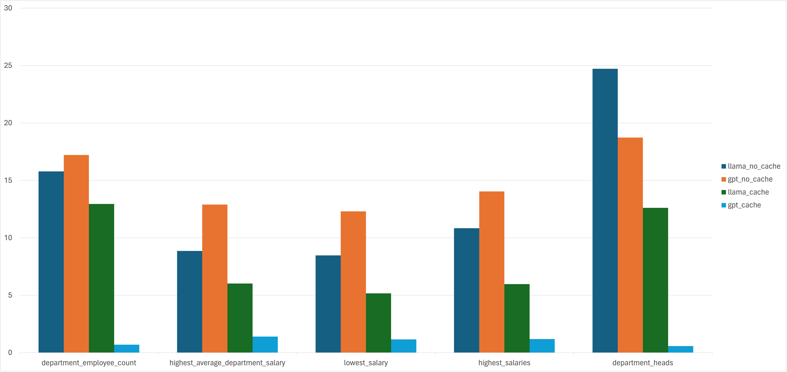

# MYSQL Example

Since this example requires the ability to access a mysql database with loaded data, this document serves as a guide in how to set up a given environment so that the example can be run as provided.

## Prerequisites

- [docker](https://www.docker.com/get-started/)
- `wget`
- `mysql`

## Setting Environment Variables

These are the same variables that would need to be set when invoking the tool, so whatever they are set to in the process of setting up the example database is what should be passed into the tool calls.

| variable  | example value        |
| --------- | -------------------- |
| `DB_USER` | `root`               |
| `DB_PASS` | `your_root_password` |
| `DB_HOST` | `localhost`          |
| `DB_PORT` | `3306`               |
| `DB_NAME` | `employees`          |

## Deploying a MYSQL Container in Docker Locally

To deploy a docker container containing a MYSQL container locally, run the following command:

```bash
docker run -d --name mysql_container -e MYSQL_ROOT_PASSWORD=$DB_PASS -p 3306:$DB_PORT mysql:latest
```

## Loading Data

We will utilize an [example database](https://github.com/datacharmer/test_db). Pull the example data and load into the mysql database with the following command:

```bash
wget https://github.com/datacharmer/test_db/archive/refs/heads/master.zip && unzip master.zip && cd test_db-master && mysql -h $DB_HOST -P $DB_PORT -u $DB_USER --password=$DB_PASS -t < employees.sql
```

## Results From Tool Runs

The following is a comparison between the tool implemented here and the responses from a wrapper around llama index. There was some additional variance in the responses and generated queries from this tool, the logs of which can be seen in the `results` directory.



Some notable examples of limitations of the tool include an encountered panic, a level of unexpected variance in creation of sql queries, and sometimes different or incorrect results. These are all relatively uncommon, and could all be mitigated with additional prompt engineering. This is particularly the case if additional clarity is provided in queries, as well as additional context of database contents.
